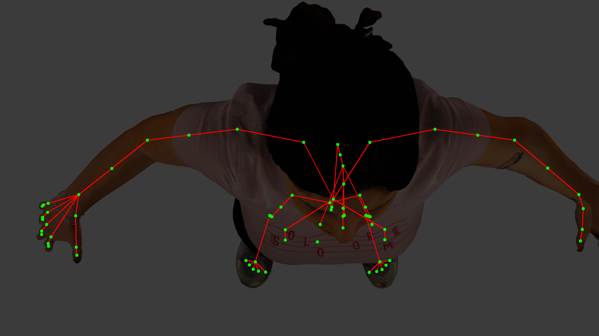
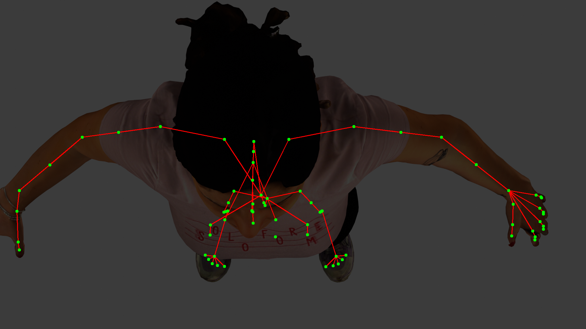

# CV_PROJECT

Project for the Computer Vision course of University of Trento 2023/24. Main topics are the 2D perspective projection and 3D reconstruction.
## Table of Contents
1. [Project Overview](#project-overview)
2. [Results](#results)
3. [Project Structure](#project-structure)
4. [Dependencies](#dependencies)
5. [Usage](#usage)

## Project Overview
This project focuses on human pose estimation using a synthetic pipeline. Our goal is to obtain the 2D corresponding points in an image from a 3D coordinate mesh in the real world. Additionally by utilizing a stereo rig configuration with two cameras, we aim to compute the 3D pose from two 2D coordinate projections.

The primary steps of the project are:
- Setting up a 3D human mesh with a skeletal structure in Blender.
- Placing an egocentric camera above the mesh to simulate real-world wearable setups.
- Extracting 3D joint coordinates and mapping them to a 2D image plane using perspective projection.
- Using a stereo camera rig to obtain 2 images and reconstruct 3D poses through triangulation.
- Evaluating the accuracy of the reconstructed poses by comparing them to ground-truth data.

## Results
The outcomes are
nearly perfect. However, we are aware that achieving
such precision in a real-world scenario is very unlikely
due to several factors such as noise and distortions.

The results are stored in the `out` folder.
### 2D Projection
An example of the output of 2D projection using 2 camera with a baseline of 12 cm. *Generated using:* `python main.py `
<p align="center">
  
  
</p>

### 3D Reconstruction
The results of the project were evaluated using the **Mean Per Joint Position Error (MPJPE)** metric. The table below summarizes the key error values obtained during testing.
The full reconstruction can be found in `out/reconstructed_3d_points.txt`
| Error Metric                 | Value (mm)    |
|------------------------------|--------------|
| Mean Absolute Error X        | 3.57 × 10⁻⁵  |
| Mean Absolute Error Y        | 1.19 × 10⁻⁵  |
| Mean Absolute Error Z        | 0.00045      |
| MPJPE                        | 0.00049      |


## Project Structure

```
CV_PROJECT/
├── assets/                         # Resources such as images or datasets
├── blender_scripts/                # Scripts for Blender processing
│   ├── estimates_3D_coordinates.py # 3D Reconstruction
│   ├── extract_3D_coordinates.py   # Extract information from the environment
│   ├── projection_2D.py            # 2D Projection
│   ├── setup_env.py                # Setting up Blender's environment
├── example_outputs/            
├── out/                            # Output folder for generated files
├── report/                        
│   ├── Report.pdf                  # Detailed report of this project
├── utility/                        
│   ├── utility.py                  # utility functions
├── .gitignore                      # Git ignore file
├──extract_info.py                  # Uses the blender script to extract the information 
├──highlight_points.py              # Highlight the 2D point of the image
├── main.py                         # Main script for coordinating tasks
├── readme.md                       # Readme 
├── requirements.txt                # Requirements
```

## Dependencies
- Python 3.7+
- Blender (Ensure the executable path is configured correctly)
- Change the path in  `main.py` file !!!!

if dependencies error appears, install the requirements globally `sudo apt install python3-xyz` (replace `xyz` with the python package you want to install)
```
# Path to the Blender executable (adjust according to your system)
blender_path = "/usr/bin/blender"
```
- Install the requirements in the requirements.txt
```bash
pip install -r requirements.txt
```

## Usage
- Install the project
```
git clone git@github.com:marco3724/CV_project.git
```
The main script, `main.py`, coordinates the workflow and allows you to pass arguments for configuring the camera setup. Below are the available arguments and their descriptions:

### Command-Line Arguments

| Argument     | Description                                              | Format                 |
|--------------|----------------------------------------------------------|------------------------|
| `-n`         | Number of cameras to use in the setup                    | Integer (e.g., 2)      |
| `-t`         | Translation offset of the cameras in cm                  | `x,y,z` (e.g., 1,0,0)  |
| `-r`         | Rotation of the cameras                                  | `x,y,z` (e.g., 0,90,0) |
| `-l`         | Set a light source                                       | (`True` of `False`)    |

### Example Usage
1. **Basic Run**
   ```bash
   python main.py 
2. **Run with parameters**
   ```bash
   python main.py -n 2 -t 1,0,0 -r 0,90,0
